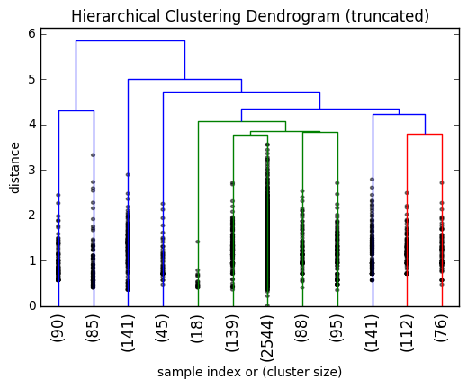

# Hierachical Clustering

The following graph is generated using a small portion of data.



The hierachial clustering algorithm is applied to check whether tags from data_sort have any similarity groups by calculating similarity distance between two tags.

As shown in the graph each node is where the alogrithm decides to combine the similar tags as one groups. The numbers beneath just the size of each cluster.

The pairwise distance between each tags is calculated by using [jaccard_index](https://en.wikipedia.org/wiki/Jaccard_index).

The codes to compute the jaccard_index:

```python
def jaccard_ind(tag1, tag2):
	intersect = set(tag1.split()).intersect(set(tag2.split())
	intersct_len = len(intersect)
	union_len = len(tag1) + len(tag2) -intersct_len
	return 1 - float(intersct_len)/float(union_len)
```
This part of code is re-written in Cython to speed up the pairwise calculation.

In consideration of speed and accuracy the cutting distance is selected at 0.5. It means the only similar groups are considered if their distances are below this threshold.
